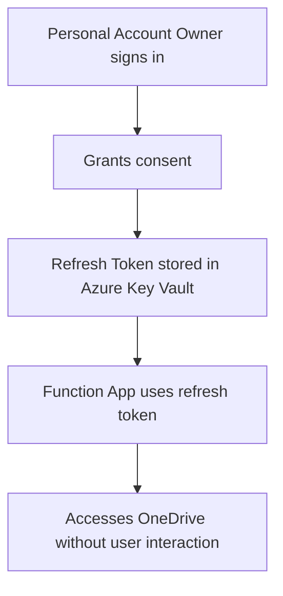

# Setting Up Photo Sync with Personal Microsoft Accounts

This guide explains how to configure PhotoSync when syncing from **personal Microsoft accounts** (outlook.com, hotmail.com, live.com) that aren't part of your Azure Entra organization.

## The Challenge

Personal Microsoft accounts cannot be managed through your organization's Entra portal. You cannot grant "admin consent" for accounts that aren't in your organization.

## Solution: Delegated Permissions with Refresh Tokens

Instead of using **application permissions** (client credentials flow), we use **delegated permissions** (authorization code flow with refresh tokens) where each account owner consents to the app accessing their OneDrive.

## Architecture Overview



## Updated Setup Steps

### Step 1: Register ONE Azure AD Application

You only need **ONE** app registration that all accounts will consent to:

1. Go to [Azure Portal](https://portal.azure.com) → **Azure Entra** → **App registrations**
2. Click **New registration**
3. Configure:
   - **Name**: `PhotoSync-MultiAccount`
   - **Supported account types**: **Accounts in any organizational directory and personal Microsoft accounts**
   - **Redirect URI**: Select "Web" and enter `http://localhost:8080/callback`
   - Click **Register**

4. After registration, note down:
   - **Application (client) ID**
   - **Directory (tenant) ID** (use `common` for multi-tenant)

5. Create a **Client Secret**:
   - Go to **Certificates & secrets**
   - Click **New client secret**
   - Description: "PhotoSync Secret"
   - Expires: 24 months
   - Copy the **secret value** immediately

6. Configure **API Permissions** (Delegated, NOT Application):
   - Go to **API permissions**
   - Click **Add a permission** → **Microsoft Graph**
   - Select **Delegated permissions**
   - Add these permissions:
     - `Files.Read`
     - `Files.ReadWrite`
     - `offline_access` (critical - allows refresh tokens)
   - Click **Add permissions**
   - **DO NOT** click "Grant admin consent" (each user will consent individually)

### Step 2: Get Consent and Refresh Tokens for Each Account

You need to get a **refresh token** for each OneDrive account (yours, wife's, shared destination).

#### Use the Node.js Helper Script (Recommended)

We've provided a ready-to-use script at [`tools/get-refresh-token.js`](tools/get-refresh-token.js) that handles the entire OAuth flow.

**Prerequisites:**
- Node.js 18+ (includes built-in `fetch`, no external dependencies needed)

**Usage:**

```bash
cd tools
echo "Enter your Client ID: "
read -s CLIENT_ID
echo "Enter your Client Secret: "
read -s CLIENT_SECRET
node get-refresh-token.js $CLIENT_ID $CLIENT_SECRET
```

**What it does:**
1. Opens your browser to Microsoft's login page
2. You sign in with the Microsoft account you want to authorize
3. You grant the requested permissions (Files.Read, Files.ReadWrite, offline_access)
4. The script receives the authorization code and exchanges it for tokens
5. Displays the refresh token in your terminal

**Run for each account:**

```bash
# For your account
node get-refresh-token.js your-client-id your-client-secret

# For wife's account (have her sign in when browser opens)
node get-refresh-token.js your-client-id your-client-secret

# For shared destination account
node get-refresh-token.js your-client-id your-client-secret
```

**Important:** All three accounts use the **same** Client ID and Client Secret (from the single app registration you created in Step 1).

See [`tools/README.md`](tools/README.md) for more details and troubleshooting.

### Step 3: Store Refresh Tokens Securely in Azure Key Vault

**DO NOT** store refresh tokens in configuration files or environment variables directly in production.

1. **Create Azure Key Vault:**
   ```bash
   az keyvault create \
     --name photosync-vault \
     --resource-group PhotoSyncRG \
     --location westeurope
   ```

2. **Store refresh tokens as secrets:**
   ```bash
   # Your account
   az keyvault secret set \
     --vault-name photosync-vault \
     --name source1-refresh-token \
     --value "YOUR_REFRESH_TOKEN_1"

   # Wife's account
   az keyvault secret set \
     --vault-name photosync-vault \
     --name source2-refresh-token \
     --value "YOUR_REFRESH_TOKEN_2"

   # Destination account
   az keyvault secret set \
     --vault-name photosync-vault \
     --name destination-refresh-token \
     --value "YOUR_REFRESH_TOKEN_3"
   ```

3. **Grant Function App access to Key Vault:**
   ```bash
   # Enable managed identity for Function App
   az functionapp identity assign \
     --name photosync-source1 \
     --resource-group PhotoSyncRG

   # Get the principal ID
   PRINCIPAL_ID=$(az functionapp identity show \
     --name photosync-source1 \
     --resource-group PhotoSyncRG \
     --query principalId -o tsv)

   # Grant access to Key Vault
   az keyvault set-policy \
     --name photosync-vault \
     --object-id $PRINCIPAL_ID \
     --secret-permissions get list
   ```

### Step 4: Deploy Infrastructure with Terraform

The PhotoSync application is fully configured to support refresh token authentication. You just need to enable Key Vault when deploying:

```bash
cd terraform
cp terraform.tfvars.example terraform.tfvars
```

Edit `terraform.tfvars` to enable Key Vault:

```hcl
# Enable Key Vault
enable_keyvault = true
key_vault_name  = "photosync-kv-UNIQUE"  # Must be globally unique

# Store the refresh tokens you obtained in Step 2
source1_refresh_token      = "0.AXEA..."  # Your refresh token
source2_refresh_token      = "0.AXEA..."  # Wife's refresh token
destination_refresh_token  = "0.AXEA..."  # Shared account refresh token

# Store the client secret from Step 1
source1_client_secret_for_vault      = "your-actual-client-secret"
source2_client_secret_for_vault      = "your-actual-client-secret"  # Same
destination_client_secret_for_vault  = "your-actual-client-secret"  # Same

# Configure Function Apps to use refresh tokens
# Use "common" as tenant ID for personal accounts
# ClientSecret value should be the Key Vault secret NAME, not the actual token
onedrive1_config = {
  "OneDrive1:ClientId"              = "your-client-id"
  "OneDrive1:TenantId"              = "common"
  "OneDrive1:ClientSecret"          = "source1-refresh-token"  # Secret NAME for refresh token
  "OneDrive1:ClientSecretName"      = "source1-client-secret"  # Optional: Secret NAME for OAuth client secret
  "OneDrive1:SourceFolder"          = "Pictures/CameraRoll"
  "OneDrive1:DeleteAfterSync"       = "false"
}

onedrive2_config = {
  "OneDrive2:ClientId"              = "your-client-id"  # Same
  "OneDrive2:TenantId"              = "common"
  "OneDrive2:ClientSecret"          = "source2-refresh-token"  # Secret NAME for refresh token
  "OneDrive2:ClientSecretName"      = "source2-client-secret"  # Optional: Secret NAME for OAuth client secret
  "OneDrive2:SourceFolder"          = "Pictures/CameraRoll"
  "OneDrive2:DeleteAfterSync"       = "false"
}

onedrive_destination_config = {
  "OneDriveDestination:ClientId"            = "your-client-id"  # Same
  "OneDriveDestination:TenantId"            = "common"
  "OneDriveDestination:ClientSecret"        = "destination-refresh-token"  # Secret NAME for refresh token
  "OneDriveDestination:ClientSecretName"    = "destination-client-secret"  # Optional: Secret NAME for OAuth client secret
  "OneDriveDestination:DestinationFolder"   = "Pictures/FamilyPhotos"
}
```

Deploy:

```bash
terraform init
terraform apply
```

### Step 5: Configure Function Apps for Refresh Token Mode

After Terraform completes, configure both Function Apps to use refresh token authentication:

```bash
# Get outputs from Terraform
SOURCE1=$(terraform output -raw function_app_source1_name)
SOURCE2=$(terraform output -raw function_app_source2_name)
VAULT_URI=$(terraform output -raw key_vault_uri)

# Configure Function App 1
az functionapp config appsettings set \
  --name $SOURCE1 \
  --resource-group photosync-rg \
  --settings \
    "UseRefreshTokenAuth=true" \
    "KeyVault:VaultUrl=$VAULT_URI"

# Configure Function App 2
az functionapp config appsettings set \
  --name $SOURCE2 \
  --resource-group photosync-rg \
  --settings \
    "UseRefreshTokenAuth=true" \
    "KeyVault:VaultUrl=$VAULT_URI"
```

### Step 6: Deploy Function Code

```bash
cd ../src
func azure functionapp publish $SOURCE1
func azure functionapp publish $SOURCE2
```

## Done! 🎉

Your PhotoSync is now running with personal Microsoft accounts using secure refresh token authentication.

## How It Works

1. **One App Registration**: All accounts use the same Azure AD app
2. **Delegated Permissions**: Each user consents individually
3. **Refresh Tokens**: Long-lived tokens (90 days) stored in Key Vault, auto-renewed when used
4. **Function Apps**: Use managed identities to retrieve tokens from Key Vault
5. **Token Exchange**: Refresh tokens are exchanged for short-lived access tokens on demand

## Configuration Options

### Client Secret Name (Optional)

By default, all sources share the same OAuth client secret stored under the name `source1-client-secret` in Key Vault. This works fine when all accounts use the same Azure AD app registration (which is typical for personal accounts).

However, if you need different client secrets for different sources (e.g., using multiple app registrations), you can configure the client secret name per source:

```
OneDriveSource:ClientSecretName = "source1-client-secret"
OneDriveDestination:ClientSecretName = "destination-client-secret"
```

If not specified, the system falls back to:
1. The value from `KeyVault:ClientSecretName` configuration (if set)
2. The default `source1-client-secret` (for backward compatibility)

This configuration is stored in Key Vault secrets following the naming pattern used by Terraform:
- `source1-client-secret`
- `source2-client-secret`
- `destination-client-secret`

## Benefits

✅ **One-time setup** per account
✅ **No admin consent** required
✅ **Automatic renewal** - refresh tokens auto-renew when used
✅ **Secure storage** - tokens in Azure Key Vault, not in configuration
✅ **User control** - users can revoke access anytime via their Microsoft account settings
✅ **Low cost** - only adds ~$0.10/month for Key Vault

## Alternative: Azure AD B2C

Another approach is **Azure AD B2C** (Business to Consumer) designed for external user accounts, but this adds significant complexity and isn't recommended for this use case.
