# Photo Sync Azure Function

Automated solution for syncing family photos from multiple OneDrive accounts into a single consolidated location. This Azure Function runs daily, downloads photos, renames them based on EXIF metadata, and uploads to a destination OneDrive account.

## Project Structure

```
photosync/
├── src/                      # C# source code
│   ├── PhotoSyncFunction.cs  # Main sync function
│   ├── ManualTrigger.cs      # Manual trigger endpoint
│   ├── ValidateConfig.cs     # Configuration validation
│   ├── ConfigurationValidator.cs
│   ├── StateManager.cs       # Sync state management
│   ├── Program.cs            # App entry point
│   ├── PhotoSync.csproj      # .NET project file
│   ├── PhotoSync.sln         # Solution file
│   ├── host.json             # Function host config
│   └── local.settings.json   # Local development settings
│
├── tests/                    # Test suites
│   ├── PhotoSync.Tests/      # Unit tests (74 tests)
│   │   ├── PhotoSyncFunctionTests.cs
│   │   ├── PhotoSyncServiceTests.cs
│   │   ├── StateManagerTests.cs
│   │   └── ConfigurationValidatorTests.cs
│   └── PhotoSync.IntegrationTests/  # Integration tests (9 tests)
│       └── StateManagerIntegrationTests.cs
│
├── terraform/                # Infrastructure as Code
│   ├── main.tf               # Main Terraform config
│   ├── variables.tf          # Variable definitions
│   ├── outputs.tf            # Output values
│   ├── terraform.tfvars.example
│   ├── modules/
│   │   └── function-app/     # Reusable Function App module
│   ├── TERRAFORM.md          # Terraform deployment guide
│   └── .gitignore           # Terraform-specific ignores
│
└── *.md                      # Documentation files
```

## Features

- ✅ Syncs photos from multiple OneDrive source accounts
- ✅ Automatic file renaming based on EXIF date/time metadata
- ✅ Fallback filename parsing for photos without EXIF data
- ✅ Duplicate detection using Azure Table Storage
- ✅ Optional deletion of source files after successful sync
- ✅ Scheduled execution (daily at 2 AM UTC)
- ✅ Support for large files (chunked upload)
- ✅ Comprehensive logging with Application Insights
- ✅ Supports common image formats: JPG, PNG, HEIC, RAW, etc.

## Architecture

**Two Separate Function Apps for Complete Isolation:**

```mermaid
graph TB
    subgraph "Source Accounts"
        OD1[("OneDrive #1<br/>(Your Photos)")]
        OD2[("OneDrive #2<br/>(Wife's Photos)")]
    end

    subgraph "Azure Resource Group"
        subgraph "Function App #1"
            FA1["PhotoSync Function<br/>⏰ Timer: Daily 2 AM UTC"]
            ST1[("Storage Account<br/>State Tracking")]
        end

        subgraph "Function App #2"
            FA2["PhotoSync Function<br/>⏰ Timer: Daily 2 AM UTC"]
            ST2[("Storage Account<br/>State Tracking")]
        end

        AI["Application Insights<br/>📊 Monitoring & Logs"]

        TS[("Azure Table Storage<br/>Shared State")]
    end

    subgraph "Destination"
        ODD[("OneDrive Destination<br/>(Family Photos)")]
    end

    OD1 -->|"1. Read Photos<br/>(Microsoft Graph API)"| FA1
    FA1 -->|"2. Download"| FA1
    FA1 -->|"3. Extract EXIF<br/>4. Rename"| FA1
    FA1 -->|"5. Upload<br/>(Microsoft Graph API)"| ODD
    FA1 -.->|"6. Delete Source<br/>(Optional)"| OD1
    FA1 -.->|"Track Processed"| TS
    ST1 -.->|"Function State"| FA1

    OD2 -->|"1. Read Photos<br/>(Microsoft Graph API)"| FA2
    FA2 -->|"2. Download"| FA2
    FA2 -->|"3. Extract EXIF<br/>4. Rename"| FA2
    FA2 -->|"5. Upload<br/>(Microsoft Graph API)"| ODD
    FA2 -.->|"6. Delete Source<br/>(Optional)"| OD2
    FA2 -.->|"Track Processed"| TS
    ST2 -.->|"Function State"| FA2

    FA1 -.->|"Logs & Metrics"| AI
    FA2 -.->|"Logs & Metrics"| AI

    classDef onedrive fill:#0078D4,stroke:#004578,color:#fff
    classDef function fill:#5E5E5E,stroke:#333,color:#fff
    classDef storage fill:#FFB900,stroke:#CC9300,color:#000
    classDef insights fill:#68217A,stroke:#4A1858,color:#fff

    class OD1,OD2,ODD onedrive
    class FA1,FA2 function
    class ST1,ST2,TS storage
    class AI insights
```



**Why Two Function Apps?**
- **Complete Isolation** - Issues in one source don't affect the other
- **Independent Scaling** - Each app scales based on its workload
- **Better Security** - Each app only has credentials for its source account
- **Easier Monitoring** - Separate logs and metrics per source
- **Same Cost** - Consumption Plan charges per execution, not per app

**Key Components:**
- **Function Apps**: Run identical code, configured for different source accounts
- **Storage Accounts**: Each Function App has its own storage for state management
- **Shared Table Storage**: Tracks processed files to prevent duplicates
- **Application Insights**: Centralized monitoring and logging for both apps
- **Optional Source Deletion**: Configurable per Function App to delete source files after successful upload (prevents duplication)

See [ARCHITECTURE_CHANGES.md](ARCHITECTURE_CHANGES.md) for details on the migration and benefits.

## Prerequisites

1. **Azure Subscription** - [Create free account](https://azure.microsoft.com/free/)
2. **.NET 8.0 SDK** - [Download here](https://dotnet.microsoft.com/download)
3. **Azure Functions Core Tools** - Install via:
   ```bash
   npm install -g azure-functions-core-tools@4
   ```
   Alternatively, use `brew`: 
```
brew tap azure/functions
brew install azure-functions-core-tools@4
```
4. **Terraform** (for infrastructure deployment) - [Download here](https://www.terraform.io/downloads)
5. **Azure CLI** - [Download here](https://docs.microsoft.com/cli/azure/install-azure-cli)
6. **Visual Studio 2022** or **VS Code** with Azure Functions extension

## Setup Instructions

**⚠️ Important: Personal Microsoft Accounts**

If you're syncing from **personal Microsoft accounts** (outlook.com, hotmail.com, live.com) that aren't part of your Azure organization, you **cannot** use the standard setup below. Instead, see [PERSONAL_ACCOUNTS_SETUP.md](PERSONAL_ACCOUNTS_SETUP.md) for instructions on using refresh token authentication.

The instructions below are for **organizational accounts** only.

---

### Step 1: Register Azure AD Applications (Organizational Accounts Only)

⚠️ **Skip this section if using personal accounts** - see [PERSONAL_ACCOUNTS_SETUP.md](PERSONAL_ACCOUNTS_SETUP.md) instead.

You need to create 3 Azure AD app registrations (one for each OneDrive account):

1. Go to [Azure Portal](https://portal.azure.com) → **Azure Entra** → **App registrations**
2. Click **New registration**
3. Configure:
   - **Name**: `PhotoSync-OneDrive1` (use descriptive names)
   - **Supported account types**: Accounts in this organizational directory only
   - Click **Register**

4. After registration:
   - Copy the **Application (client) ID**
   - Copy the **Directory (tenant) ID**
   - Go to **Certificates & secrets** → **New client secret**
   - Create a secret and **copy the value immediately** (you can't see it again)

5. Grant API permissions:
   - Go to **API permissions** → **Add a permission**
   - Select **Microsoft Graph** → **Application permissions**
   - Add these permissions:
     - `Files.Read.All`
     - `Files.ReadWrite.All`
   - Click **Grant admin consent**

6. **Repeat steps 2-5 for each OneDrive account** (your account, wife's account, destination account)

### Step 2: Configure the Function

For **local development**, configure a single source account to test with:

1. Open `local.settings.json` and fill in your credentials:

```json
{
  "Values": {
    "AzureWebJobsStorage": "UseDevelopmentStorage=true",
    "FUNCTIONS_WORKER_RUNTIME": "dotnet-isolated",

    "OneDriveSource:ClientId": "abc123...",
    "OneDriveSource:TenantId": "xyz789...",
    "OneDriveSource:ClientSecret": "secret1...",
    "OneDriveSource:SourceFolder": "Pictures/CameraRoll",
    "OneDriveSource:DeleteAfterSync": "false",

    "OneDriveDestination:ClientId": "ghi789...",
    "OneDriveDestination:TenantId": "rst345...",
    "OneDriveDestination:ClientSecret": "secret3...",
    "OneDriveDestination:DestinationFolder": "Pictures/FamilyPhotos"
  }
}
```

For **production deployment** with two Function Apps, use Terraform to configure both sources (see Step 4 below).

**Important Notes:**
- Each Function App deployment handles one source account (`OneDriveSource`)
- Set `DeleteAfterSync` to `true` to automatically delete source files after successful upload (prevents duplication)
- Set `DeleteAfterSync` to `false` (default) to keep source files in place
- Folder paths are relative to the OneDrive root (no leading slash)
- Use forward slashes `/` for folder paths
- The destination folder will be created automatically if it doesn't exist

### Step 3: Local Testing

1. Install Azurite (Azure Storage Emulator):
   ```bash
   npm install -g azurite
   ```

2. Start Azurite:
   ```bash
   azurite --silent --location c:\azurite --debug c:\azurite\debug.log
   ```

3. Build and run the function:
   ```bash
   cd src
   dotnet build
   func start
   ```

4. To trigger the function manually (without waiting for the schedule):
   - Open a new terminal and run:
   ```bash
   curl http://localhost:7071/admin/functions/PhotoSyncTimer -X POST -H "Content-Type: application/json" -d "{}"
   ```

### Step 4: Deploy to Azure

#### Option A: Using Terraform (Recommended)

This will deploy **two separate Function Apps** (one for each source account).

See [terraform/TERRAFORM.md](terraform/TERRAFORM.md) for detailed instructions.

```bash
cd terraform
cp terraform.tfvars.example terraform.tfvars
# Edit terraform.tfvars with credentials for both source accounts
terraform init
terraform plan
terraform apply
```

Then deploy the function code to **both Function Apps**:
```bash
# Get the Function App names from Terraform outputs
SOURCE1=$(terraform output -raw function_app_source1_name)
SOURCE2=$(terraform output -raw function_app_source2_name)

# Deploy to both apps
cd ../src
func azure functionapp publish $SOURCE1
func azure functionapp publish $SOURCE2
```

#### Option B: Using Azure CLI

**Note**: You need to create and deploy to **two separate Function Apps** for complete isolation.

1. Login to Azure:
   ```bash
   az login
   ```

2. Create a resource group:
   ```bash
   az group create --name PhotoSyncRG --location westeurope
   ```

3. Create storage accounts and Function Apps for both sources:
   ```bash
   # Source 1
   az storage account create --name photosyncsrc1 --location westeurope --resource-group PhotoSyncRG --sku Standard_LRS
   az functionapp create --resource-group PhotoSyncRG --consumption-plan-location westeurope \
     --runtime dotnet-isolated --functions-version 4 --name photosync-source1 \
     --storage-account photosyncsrc1 --os-type Linux

   # Source 2
   az storage account create --name photosyncsrc2 --location westeurope --resource-group PhotoSyncRG --sku Standard_LRS
   az functionapp create --resource-group PhotoSyncRG --consumption-plan-location westeurope \
     --runtime dotnet-isolated --functions-version 4 --name photosync-source2 \
     --storage-account photosyncsrc2 --os-type Linux
   ```

4. Configure application settings for Source 1:
   ```bash
   az functionapp config appsettings set --name photosync-source1 \
     --resource-group PhotoSyncRG \
     --settings "OneDriveSource:ClientId=your-source1-client-id" \
                "OneDriveSource:TenantId=your-source1-tenant-id" \
                "OneDriveSource:ClientSecret=your-source1-secret" \
                "OneDriveSource:SourceFolder=Pictures/CameraRoll" \
                "OneDriveSource:DeleteAfterSync=false" \
                "OneDriveDestination:ClientId=your-dest-client-id" \
                "OneDriveDestination:TenantId=your-dest-tenant-id" \
                "OneDriveDestination:ClientSecret=your-dest-secret" \
                "OneDriveDestination:DestinationFolder=Pictures/FamilyPhotos"
   ```

5. Configure application settings for Source 2 (repeat with source 2 credentials)
   - Set `DeleteAfterSync=true` if you want to automatically delete source files after sync
   - Set `DeleteAfterSync=false` (or omit it) to keep source files

6. Deploy the function code to both apps:
   ```bash
   func azure functionapp publish photosync-source1
   func azure functionapp publish photosync-source2
   ```

### Step 5: Configure Schedule

The function is set to run daily at 2 AM UTC. To change this:

1. Open `PhotoSyncFunction.cs`
2. Modify the cron expression in the `TimerTrigger` attribute:
   ```csharp
   [TimerTrigger("0 0 2 * * *")] // "second minute hour day month dayOfWeek"
   ```

Examples:
- Every day at 2 AM: `"0 0 2 * * *"`
- Every 6 hours: `"0 0 */6 * * *"`
- Every day at noon: `"0 0 12 * * *"`

## Testing

The project includes comprehensive test coverage with **83 tests total**:
- **74 unit tests** in `tests/PhotoSync.Tests/` using xUnit and Moq
- **9 integration tests** in `tests/PhotoSync.IntegrationTests/` using Testcontainers and Azurite

### Run All Tests

```bash
# From project root - runs both unit and integration tests
dotnet test

# Or run individually
cd tests/PhotoSync.Tests
dotnet test

cd tests/PhotoSync.IntegrationTests
dotnet test
```

### Run with Coverage

Generate a combined coverage report from both test suites:

```bash
# Quick way (from project root) - recommended
./generate-coverage-report.sh

# This script will:
# 1. Run unit tests (74 tests) with coverage
# 2. Run integration tests (9 tests) with coverage
# 3. Generate combined HTML report
# 4. Track coverage history
# 5. Open report in browser
```

The HTML report shows:
- 📊 Overall coverage percentages from both test suites
- 📈 Line-by-line coverage (green/red highlighting)
- 📁 Per-file coverage breakdown
- 🔍 Method-level details
- 📈 Coverage history trends

### Test Structure

**Unit Tests** (tests/PhotoSync.Tests/):
- **PhotoSyncFunctionTests**: Tests timer trigger and logging
- **PhotoSyncServiceTests**: Tests core sync logic and filename generation
- **StateManagerTests**: Tests state management logic (mocked)
- **ConfigurationValidatorTests**: Tests configuration validation
- **ManualTriggerTests**: Tests manual trigger endpoint

**Integration Tests** (tests/PhotoSync.IntegrationTests/):
- **StateManagerIntegrationTests**: End-to-end tests with real Azure Table Storage via Testcontainers
- Requires Docker to be running

For detailed testing and coverage documentation, see [COVERAGE_GUIDE.md](COVERAGE_GUIDE.md).

## File Naming Convention

The function renames files using this priority:

1. **EXIF DateTime**: `20231225_143022.jpg` (from EXIF DateTimeOriginal tag)
2. **Filename parsing**: Extracts date from patterns like `IMG_20231225_143022.jpg`
3. **Original filename**: If no date can be determined

## Monitoring

### View Logs

In Azure Portal:
1. Go to your Function App
2. Click **Log stream** or **Monitor**
3. View real-time logs and execution history

### Application Insights

The function automatically logs to Application Insights:
- Go to Function App → **Application Insights**
- View metrics, failures, and performance data

## Troubleshooting

### Common Issues

**Error: "Insufficient privileges to complete the operation"**
- Solution: Ensure you granted admin consent for Microsoft Graph API permissions
- Go to Azure AD → App registrations → API permissions → Grant admin consent

**Error: "The specified path does not exist"**
- Solution: Check that folder paths in configuration are correct (no leading slash)
- Create the folders manually in OneDrive if needed

**Error: "Authentication failed"**
- Solution: Verify client ID, tenant ID, and client secret are correct
- Check that the client secret hasn't expired (regenerate if needed)

**Photos aren't syncing**
- Check the logs for specific errors
- Verify the source folders contain photos
- Ensure photos have supported extensions (.jpg, .png, etc.)

**State tracking issues**
- Clear the state: Delete all records from the `ProcessedPhotos` table in Azure Storage
- The function will re-process all photos (will not create duplicates if they already exist)

## Cost Estimation

Based on moderate usage (500 photos/month with two Function Apps):

- **Azure Functions Consumption Plan (2 apps)**: ~$0.40/month
- **Azure Storage (2 storage accounts)**: ~$0.10/month
- **Data Transfer**: ~$1-2/month (depends on photo sizes)
- **Application Insights**: Free tier should suffice

**Total: ~$2.50-3/month**

Note: The Consumption Plan charges per execution, so running two Function Apps costs nearly the same as one.

## Extending the Solution

### Add More Source Accounts

To add a third (or more) source account:

1. In `terraform/main.tf`, add another module instance:

```hcl
module "function_app_source3" {
  source = "./modules/function-app"

  function_app_name    = "${var.function_app_name_prefix}-source3"
  storage_account_name = "${var.storage_account_name_prefix}src3"

  source_config = {
    for key, value in var.onedrive3_config :
    replace(key, "OneDrive3:", "OneDriveSource:") => value
  }

  destination_config = var.onedrive_destination_config

  resource_group_name = azurerm_resource_group.photosync.name
  location           = var.location
  app_insights_key   = azurerm_application_insights.photosync.instrumentation_key
}
```

2. Deploy the new Function App and publish code to it
3. Each Function App runs independently with complete isolation

See [ARCHITECTURE_CHANGES.md](ARCHITECTURE_CHANGES.md) for more details on the modular architecture.

### Add NAS Sync

To sync back to your NAS, you could:
1. Mount NAS as Azure File Share
2. Use Azure File Sync
3. Or add a separate function to download from destination OneDrive to NAS

### Add Video Support

Modify the `photoExtensions` array in `GetPhotosFromFolderAsync`:

```csharp
var photoExtensions = new[] { 
    ".jpg", ".jpeg", ".png", ".heic", ".heif", 
    ".mp4", ".mov", ".avi" // Add video formats
};
```

### Add Organizing by Date

You can organize photos into folders by year/month. In `UploadPhotoAsync`, modify the upload path:

```csharp
var dateTaken = // extract date from EXIF or filename
var uploadPath = $"{destinationFolder}/{dateTaken.Year}/{dateTaken.Month:00}/{fileName}";
```

## Security Best Practices

1. **Never commit `local.settings.json`** - It's in `.gitignore` for a reason
2. **Rotate secrets regularly** - Update client secrets every 6-12 months
3. **Use Azure Key Vault** - For production, store secrets in Key Vault
4. **Limit permissions** - Only grant necessary Microsoft Graph permissions
5. **Monitor access** - Enable Azure AD sign-in logs and review regularly

## Support

For issues or questions:
1. Check the logs in Azure Portal
2. Review the troubleshooting section above
3. Check Microsoft Graph API documentation: https://docs.microsoft.com/graph/

## License

This solution is provided as-is for personal use. Modify as needed for your requirements.
