# Photo Sync Azure Function

[](https://github.com/louisledev/photosync/actions/workflows/build-test.yml)
[](https://github.com/louisledev/photosync/actions/workflows/deploy.yml)
[](https://github.com/louisledev/photosync/actions/workflows/security.yml)
[](https://github.com/louisledev/photosync/actions/workflows/security-checklist.yml)

Automated solution for syncing family photos from multiple OneDrive accounts into a single consolidated location. This Azure Function runs daily, downloads photos, renames them based on EXIF metadata, and uploads to a destination OneDrive account.

## Project Structure

```
photosync/
├── src/                      # C# source code
│   ├── PhotoSyncFunction.cs  # Main sync function
│   ├── ManualTrigger.cs      # Manual trigger endpoint
│   ├── ValidateConfig.cs     # Configuration validation
│   ├── ConfigurationValidator.cs
│   ├── StateManager.cs       # Sync state management
│   ├── Program.cs            # App entry point
│   ├── PhotoSync.csproj      # .NET project file
│   ├── PhotoSync.sln         # Solution file
│   ├── host.json             # Function host config
│   └── local.settings.json   # Local development settings
│
├── tests/                    # Test suites
│   ├── PhotoSync.Tests/      # Unit tests (74 tests)
│   │   ├── PhotoSyncFunctionTests.cs
│   │   ├── PhotoSyncServiceTests.cs
│   │   ├── StateManagerTests.cs
│   │   └── ConfigurationValidatorTests.cs
│   └── PhotoSync.IntegrationTests/  # Integration tests (9 tests)
│       └── StateManagerIntegrationTests.cs
│
├── terraform/                # Infrastructure as Code
│   ├── main.tf               # Main Terraform config
│   ├── variables.tf          # Variable definitions
│   ├── outputs.tf            # Output values
│   ├── terraform.tfvars.example
│   ├── modules/
│   │   └── function-app/     # Reusable Function App module
│   ├── TERRAFORM.md          # Terraform deployment guide
│   └── .gitignore           # Terraform-specific ignores
│
├── azure-pipelines-ci.yml    # Azure Pipelines CI (TESTING ONLY)
├── azure-pipelines-cd.yml    # Azure Pipelines CD (TESTING ONLY)
│
└── *.md                      # Documentation files
```

## Features

- ✅ Syncs photos from multiple OneDrive source accounts
- ✅ Automatic file renaming based on EXIF date/time metadata
- ✅ Fallback filename parsing for photos without EXIF data
- ✅ Duplicate detection using Azure Table Storage
- ✅ Optional deletion of source files after successful sync
- ✅ Scheduled execution (daily at 2 AM UTC)
- ✅ Support for large files (chunked upload)
- ✅ Comprehensive logging with Application Insights
- ✅ Supports common image formats: JPG, PNG, HEIC, RAW, etc.

## Architecture

**Two Separate Function Apps for Complete Isolation:**

```mermaid
graph TB
    subgraph "Source Accounts"
        OD1[("OneDrive #1<br/>(Your Photos)")]
        OD2[("OneDrive #2<br/>(Wife's Photos)")]
    end

    subgraph "Azure Resource Group"
        subgraph "Function App #1"
            FA1["PhotoSync Function<br/>⏰ Timer: Daily 2 AM UTC"]
            ST1[("Storage Account<br/>State Tracking")]
        end

        subgraph "Function App #2"
            FA2["PhotoSync Function<br/>⏰ Timer: Daily 2 AM UTC"]
            ST2[("Storage Account<br/>State Tracking")]
        end

        AI["Application Insights<br/>📊 Monitoring & Logs"]

        TS[("Azure Table Storage<br/>Shared State")]
    end

    subgraph "Destination"
        ODD[("OneDrive Destination<br/>(Family Photos)")]
    end

    OD1 -->|"1. Read Photos<br/>(Microsoft Graph API)"| FA1
    FA1 -->|"2. Download"| FA1
    FA1 -->|"3. Extract EXIF<br/>4. Rename"| FA1
    FA1 -->|"5. Upload<br/>(Microsoft Graph API)"| ODD
    FA1 -.->|"6. Delete Source<br/>(Optional)"| OD1
    FA1 -.->|"Track Processed"| TS
    ST1 -.->|"Function State"| FA1

    OD2 -->|"1. Read Photos<br/>(Microsoft Graph API)"| FA2
    FA2 -->|"2. Download"| FA2
    FA2 -->|"3. Extract EXIF<br/>4. Rename"| FA2
    FA2 -->|"5. Upload<br/>(Microsoft Graph API)"| ODD
    FA2 -.->|"6. Delete Source<br/>(Optional)"| OD2
    FA2 -.->|"Track Processed"| TS
    ST2 -.->|"Function State"| FA2

    FA1 -.->|"Logs & Metrics"| AI
    FA2 -.->|"Logs & Metrics"| AI

    classDef onedrive fill:#0078D4,stroke:#004578,color:#fff
    classDef function fill:#5E5E5E,stroke:#333,color:#fff
    classDef storage fill:#FFB900,stroke:#CC9300,color:#000
    classDef insights fill:#68217A,stroke:#4A1858,color:#fff

    class OD1,OD2,ODD onedrive
    class FA1,FA2 function
    class ST1,ST2,TS storage
    class AI insights
```



**Why Two Function Apps?**
- **Complete Isolation** - Issues in one source don't affect the other
- **Independent Scaling** - Each app scales based on its workload
- **Better Security** - Each app only has credentials for its source account
- **Easier Monitoring** - Separate logs and metrics per source
- **Same Cost** - Consumption Plan charges per execution, not per app

**Key Components:**
- **Function Apps**: Run identical code, configured for different source accounts
- **Storage Accounts**: Each Function App has its own storage for state management
- **Shared Table Storage**: Tracks processed files to prevent duplicates
- **Application Insights**: Centralized monitoring and logging for both apps
- **Optional Source Deletion**: Configurable per Function App to delete source files after successful upload (prevents duplication)

See [PROJECT_OVERVIEW.md](docs/PROJECT_OVERVIEW.md) for details on the architecture and benefits.

## Prerequisites

1. **Azure Subscription** - [Create free account](https://azure.microsoft.com/free/)
2. **.NET 8.0 SDK** - [Download here](https://dotnet.microsoft.com/download)
3. **Azure Functions Core Tools** - Install via:
   ```bash
   npm install -g azure-functions-core-tools@4
   ```
   Alternatively, use `brew`: 
```
brew tap azure/functions
brew install azure-functions-core-tools@4
```
4. **Terraform** (for infrastructure deployment) - [Download here](https://www.terraform.io/downloads)
5. **Azure CLI** - [Download here](https://docs.microsoft.com/cli/azure/install-azure-cli)
6. **Visual Studio 2022** or **VS Code** with Azure Functions extension

## Setup Instructions

**This guide is for Personal Microsoft Accounts Only**

This project is designed for **personal Microsoft accounts** (outlook.com, hotmail.com, live.com) using refresh token authentication. See [QUICKSTART.md](docs/QUICKSTART.md) for a quick start guide or [PERSONAL_ACCOUNTS_SETUP.md](docs/PERSONAL_ACCOUNTS_SETUP.md) for detailed instructions.

### Step 1: Configure Terraform

Terraform deploys all the infrastructure required for the Function Apps, including the Azure AD App Registration. You only need to configure the basic settings:

1. Copy the example configuration:
```bash
cd terraform
cp terraform.tfvars.example terraform.tfvars
```

2. Edit `terraform.tfvars` with your configuration:
```hcl
subscription_id               = "your-azure-subscription-id"
resource_group_name           = "photosync-rg"
function_app_name_prefix      = "photosync"
storage_account_name_prefix   = "photosync"
location                      = "westeurope"
enable_keyvault               = true
key_vault_name                = "photosync-kv-UNIQUE"  # Must be globally unique

# OneDrive configurations - ClientId is auto-generated by Terraform
onedrive1_config = {
  "OneDrive1:SourceFolder"           = "/Photos"
  "OneDrive1:RefreshTokenSecretName" = "source1-refresh-token"
  "OneDrive1:ClientSecretName"       = "source1-client-secret"
  "OneDrive1:DeleteAfterSync"        = "false"
  "OneDrive1:MaxFilesPerRun"         = "100"
}

onedrive2_config = {
  "OneDrive2:SourceFolder"           = "/Pictures"
  "OneDrive2:RefreshTokenSecretName" = "source2-refresh-token"
  "OneDrive2:ClientSecretName"       = "source2-client-secret"
  "OneDrive2:DeleteAfterSync"        = "false"
  "OneDrive2:MaxFilesPerRun"         = "100"
}

onedrive_destination_config = {
  "OneDriveDestination:RefreshTokenSecretName" = "destination-refresh-token"
  "OneDriveDestination:ClientSecretName"       = "destination-client-secret"
  "OneDriveDestination:DestinationFolder"      = "/Synced Photos"
}

# Leave empty for now - we'll fill these in after Step 3
source1_refresh_token      = ""
source2_refresh_token      = ""
destination_refresh_token  = ""
```

### Step 2: Deploy Infrastructure (First Run)

Deploy the infrastructure to create the App Registration:

```bash
# Login to Azure with Microsoft Graph permissions (required for App Registration)
az login --scope https://graph.microsoft.com/.default

# Initialize and apply Terraform
cd terraform
terraform init
terraform apply
```

This creates:
- **Resource Group** - Container for all PhotoSync resources
- **Azure AD App Registration** - With delegated permissions (Files.Read, Files.ReadWrite, offline_access)
- **Client Secret** - Auto-generated for OAuth authentication
- **Two Function Apps** - One per source account, with managed identities
- **Two Storage Accounts** - For Function App state and file tracking
- **Azure Key Vault** - Secure storage for refresh tokens and client secrets
- **Application Insights** - Centralized logging and monitoring
- **Log Analytics Workspace** - For security monitoring and alerts

### Step 3: Get Refresh Tokens

After Terraform completes, get refresh tokens for each personal account using the generated credentials:

```bash
# From the project root directory
node tools/get-refresh-token.js \
  $(terraform -chdir=terraform output -raw onedrive_app_client_id) \
  $(terraform -chdir=terraform output -raw onedrive_app_client_secret)
```

**What happens:**
1. Browser opens to Microsoft's login page
2. Sign in with the Microsoft account you want to authorize
3. Grant the requested permissions
4. The refresh token is displayed in the terminal

**Run for each account** (repeat the command above):
- Your personal account → save as `source1_refresh_token`
- Second account (e.g., spouse) → save as `source2_refresh_token`
- Shared destination account → save as `destination_refresh_token`

See [tools/README.md](tools/README.md) for more details.

### Step 4: Update Terraform with Tokens

Edit `terraform.tfvars` and add the refresh tokens you obtained:

```hcl
source1_refresh_token      = "M.C553_BAY..."  # Your refresh token
source2_refresh_token      = "M.C558_BAY..."  # Second account refresh token
destination_refresh_token  = "M.C505_BAY..."  # Destination account refresh token
```

Then apply again to store the tokens in Key Vault:

```bash
cd terraform
terraform apply
```

**Important Notes:**
- Each Function App deployment handles one source account
- Refresh tokens are stored securely in Azure Key Vault
- Function Apps use managed identities to access Key Vault (configured automatically by Terraform)
- Key Vault URL is automatically configured by Terraform
- Set `DeleteAfterSync` to `true` to automatically delete source files after sync
- Set `DeleteAfterSync` to `false` (default) to keep source files in place
- Set `MaxFilesPerRun` to limit files processed per run (e.g., `"100"`) to prevent timeout during initial sync
- Folder paths are relative to the OneDrive root
- Use forward slashes `/` for folder paths

### Step 5: Deploy Function Code

Deployment happens automatically via **GitHub Actions** when you push to `main`:
1. Build and Test workflow runs
2. Deploy workflow deploys to both Function Apps

To trigger manually: **Actions** → **Deploy to Azure** → **Run workflow**

**For local/manual deployment** (optional):
```bash
# From terraform directory
SOURCE1=$(terraform output -raw function_app_source1_name)
SOURCE2=$(terraform output -raw function_app_source2_name)
cd ../src
func azure functionapp publish $SOURCE1
func azure functionapp publish $SOURCE2
```

### Step 5: Configure Schedule (Optional)

The function is set to run daily at 2 AM UTC by default. To change this:

1. Open [src/PhotoSyncFunction.cs](src/PhotoSyncFunction.cs)
2. Modify the cron expression in the `TimerTrigger` attribute:
   ```csharp
   [TimerTrigger("0 0 2 * * *")] // "second minute hour day month dayOfWeek"
   ```

Examples:
- Every day at 2 AM: `"0 0 2 * * *"`
- Every 6 hours: `"0 0 */6 * * *"`
- Every day at noon: `"0 0 12 * * *"`

After changing, redeploy the code to both Function Apps.

## Continuous Deployment with GitHub Actions

The project includes a GitHub Actions workflow that automatically builds, tests, and deploys your code to Azure when you push to the `main` branch.

> **Note:** This repository is connected to an Azure DevOps project for experimentation and testing purposes. The Azure Pipelines configuration files (`azure-pipelines-ci.yml` and `azure-pipelines-cd.yml`) are used for testing Azure DevOps integration. **GitHub Actions remains the primary CI/CD solution for this project.**

### Setup GitHub Actions Deployment

To enable automatic deployment, you need to configure GitHub secrets:

#### 1. Create Azure Service Principal

Create a service principal with contributor access to your resource group:

```bash
az ad sp create-for-rbac \
  --name "photosync-github-deploy" \
  --role contributor \
  --scopes /subscriptions/$(az account show --query id -o tsv)/resourceGroups/PhotoSyncRG \
  --sdk-auth
```

**Important:** Copy the entire JSON output - you'll need it in the next step.

#### 2. Configure GitHub Secrets

Create three secrets in your GitHub repository (Settings → Secrets and variables → Actions → New repository secret):

**Using GitHub CLI (easiest):**

```bash
# Set Azure credentials (paste the JSON from step 1)
gh secret set AZURE_CREDENTIALS --body '{
  "clientId": "your-client-id",
  "clientSecret": "your-client-secret",
  "subscriptionId": "your-subscription-id",
  "tenantId": "your-tenant-id",
  ...
}'

# Set Function App names
gh secret set AZURE_FUNCTIONAPP_SOURCE1_NAME --body "photosync-source1"
gh secret set AZURE_FUNCTIONAPP_SOURCE2_NAME --body "photosync-source2"
```

**Or via GitHub Web UI:**

1. Go to your repository → **Settings** → **Secrets and variables** → **Actions**
2. Click **New repository secret**
3. Create these three secrets:
   - `AZURE_CREDENTIALS` - Paste the entire JSON from step 1
   - `AZURE_FUNCTIONAPP_SOURCE1_NAME` - Value: `photosync-source1` (or your custom name from Terraform)
   - `AZURE_FUNCTIONAPP_SOURCE2_NAME` - Value: `photosync-source2` (or your custom name from Terraform)

#### 3. Verify Deployment

Once configured, every push to `main` will:
1. ✅ Build the solution
2. ✅ Run all tests (unit + integration)
3. ✅ Publish test results
4. ✅ Deploy to both Function Apps

You can monitor deployments in the **Actions** tab of your GitHub repository.

### Manual Deployment

If you prefer manual deployment, use the Azure Functions Core Tools:

```bash
# Get Function App names from Terraform
SOURCE1=$(terraform output -raw function_app_source1_name)
SOURCE2=$(terraform output -raw function_app_source2_name)

# Deploy manually
cd src
func azure functionapp publish $SOURCE1
func azure functionapp publish $SOURCE2
```

## Testing

The project includes comprehensive test coverage with **83 tests total**:
- **74 unit tests** in `tests/PhotoSync.Tests/` using xUnit and Moq
- **9 integration tests** in `tests/PhotoSync.IntegrationTests/` using Testcontainers and Azurite

### Run All Tests

```bash
# From project root - runs both unit and integration tests
dotnet test

# Or run individually
cd tests/PhotoSync.Tests
dotnet test

cd tests/PhotoSync.IntegrationTests
dotnet test
```

### Run with Coverage

Generate a combined coverage report from both test suites:

```bash
# Quick way (from project root) - recommended
./generate-coverage-report.sh

# This script will:
# 1. Run unit tests (74 tests) with coverage
# 2. Run integration tests (9 tests) with coverage
# 3. Generate combined HTML report
# 4. Track coverage history
# 5. Open report in browser
```

The HTML report shows:
- 📊 Overall coverage percentages from both test suites
- 📈 Line-by-line coverage (green/red highlighting)
- 📁 Per-file coverage breakdown
- 🔍 Method-level details
- 📈 Coverage history trends

### Test Structure

**Unit Tests** (tests/PhotoSync.Tests/):
- **PhotoSyncFunctionTests**: Tests timer trigger and logging
- **PhotoSyncServiceTests**: Tests core sync logic and filename generation
- **StateManagerTests**: Tests state management logic (mocked)
- **ConfigurationValidatorTests**: Tests configuration validation
- **ManualTriggerTests**: Tests manual trigger endpoint

**Integration Tests** (tests/PhotoSync.IntegrationTests/):
- **StateManagerIntegrationTests**: End-to-end tests with real Azure Table Storage via Testcontainers
- Requires Docker to be running

For detailed testing and coverage documentation, see [COVERAGE_GUIDE.md](docs/COVERAGE_GUIDE.md).

## File Naming Convention

The function renames files using this priority:

1. **EXIF DateTime**: `20231225_143022.jpg` (from EXIF DateTimeOriginal tag)
2. **Filename parsing**: Extracts date from patterns like `IMG_20231225_143022.jpg`
3. **Original filename**: If no date can be determined

## Monitoring

### View Logs

In Azure Portal:
1. Go to your Function App
2. Click **Log stream** or **Monitor**
3. View real-time logs and execution history

### Application Insights

The function automatically logs to Application Insights:
- Go to Function App → **Application Insights**
- View metrics, failures, and performance data

## Troubleshooting

### Common Issues

**Error: "Insufficient privileges to complete the operation"**
- Solution: Re-authenticate with Microsoft Graph permissions:
  ```bash
  az login --scope https://graph.microsoft.com/.default
  ```
- This is required when Terraform creates or modifies the Azure AD App Registration

**Error: "The specified path does not exist"**
- Solution: Check that folder paths in configuration are correct (no leading slash)
- Create the folders manually in OneDrive if needed

**Error: "Authentication failed"**
- Solution: Verify refresh tokens are valid and not expired
- Regenerate refresh tokens using: `node tools/get-refresh-token.js $(terraform -chdir=terraform output -raw onedrive_app_client_id) $(terraform -chdir=terraform output -raw onedrive_app_client_secret)`
- Update `terraform.tfvars` with new tokens and run `terraform apply`

**Photos aren't syncing**
- Check the logs for specific errors
- Verify the source folders contain photos
- Ensure photos have supported extensions (.jpg, .png, etc.)

**State tracking issues**
- Clear the state: Delete all records from the `ProcessedPhotos` table in Azure Storage
- The function will re-process all photos (will not create duplicates if they already exist)

## Performance Limitations

### 10-Minute Timeout on Consumption Plan

The project uses Azure Functions **Consumption Plan (Y1)** which has a **maximum execution timeout of 10 minutes**. This is a hard limit that cannot be increased on this tier.

**When this becomes a problem:**
- **Initial sync with many files**: If you have thousands of photos (e.g., 7,000+ files), scanning the source folder alone can take 60-80 seconds
- **Large file processing**: Processing large photos or videos may exceed the 10-minute limit
- **Network latency**: Slow network connections can cause timeouts during upload/download

**Current workaround:**
The project includes a `MaxFilesPerRun` setting to limit files processed per execution:

```hcl
# In terraform.tfvars
onedrive1_config = {
  "OneDrive1:MaxFilesPerRun" = "20"  # Process only 20 files per run
}
```

With hourly execution (`"0 0 * * * *"`), processing 20 files/hour = 480 files/day.

**For large initial sync:**
- Set `MaxFilesPerRun` to 20-50 depending on file sizes
- Run hourly to gradually sync all files
- After initial sync completes, you can increase the value or remove the limit

### Solution: Upgrade to Premium or Dedicated Plan

If you need longer execution times, upgrade to a higher-tier plan:

#### **Premium Plan (EP1)** - Recommended for most users
- **Timeout**: Up to 60 minutes (or unlimited with proper configuration)
- **Cost**: ~$150-200/month per Function App
- **Benefits**:
  - VNet integration for secure connectivity
  - Pre-warmed instances (no cold start)
  - Unlimited execution duration (with AlwaysOn)
  - More CPU and memory
- **Best for**: Users with 10,000+ files or large video files

#### **Dedicated Plan (App Service Plan S1)**
- **Timeout**: Unlimited (no time restrictions)
- **Cost**: ~$70/month per Function App
- **Benefits**:
  - Predictable pricing
  - AlwaysOn enabled by default
  - Shared with other App Service apps to reduce cost
- **Best for**: Predictable workload, already using App Service Plan

#### **How to upgrade:**

1. **Via Azure Portal:**
   - Go to Function App → Settings → Scale up (App Service Plan)
   - Select Premium Plan (EP1) or Dedicated Plan (S1)
   - Update the `functionTimeout` in [src/host.json](src/host.json):
     ```json
     {
       "functionTimeout": "01:00:00"  // 60 minutes (or "-1" for unlimited on Dedicated)
     }
     ```

2. **Via Terraform** (recommended):
   - Update `terraform/modules/function-app/main.tf`:
     ```hcl
     # Change from "Y1" (Consumption) to "EP1" (Premium)
     resource "azurerm_service_plan" "function_plan" {
       name                = "${var.function_app_name}-plan"
       resource_group_name = var.resource_group_name
       location            = var.location
       os_type             = "Linux"
       sku_name            = "EP1"  # Changed from "Y1"
     }
     ```
   - Run `terraform apply` to update both Function Apps
   - Update [src/host.json](src/host.json) and redeploy code

**Note:** Premium/Dedicated plans cost significantly more (~50-100x) than Consumption Plan. Only upgrade if you truly need longer execution times.

## Cost Estimation

Based on moderate usage (500 photos/month with two Function Apps):

### Consumption Plan (Current)
- **Azure Functions Consumption Plan (2 apps)**: ~$0.40/month
- **Azure Storage (2 storage accounts)**: ~$0.10/month
- **Data Transfer**: ~$1-2/month (depends on photo sizes)
- **Application Insights**: Free tier should suffice

**Total: ~$2.50-3/month**

Note: The Consumption Plan charges per execution, so running two Function Apps costs nearly the same as one.

### Premium Plan (EP1) - If You Need Longer Timeout
- **Azure Functions Premium Plan (2 apps)**: ~$300-400/month
- **Azure Storage (2 storage accounts)**: ~$0.10/month
- **Data Transfer**: ~$1-2/month
- **Application Insights**: Free tier should suffice

**Total: ~$300-400/month**

### Dedicated Plan (S1) - Alternative Option
- **Azure Functions Dedicated Plan (2 apps)**: ~$140/month
- **Azure Storage (2 storage accounts)**: ~$0.10/month
- **Data Transfer**: ~$1-2/month
- **Application Insights**: Free tier should suffice

**Total: ~$140-145/month**

## Extending the Solution

### Add More Source Accounts

To add a third (or more) source account:

1. In `terraform/main.tf`, add another module instance:

```hcl
module "function_app_source3" {
  source = "./modules/function-app"

  function_app_name    = "${var.function_app_name_prefix}-source3"
  storage_account_name = "${var.storage_account_name_prefix}src3"

  source_config = {
    for key, value in var.onedrive3_config :
    replace(key, "OneDrive3:", "OneDriveSource:") => value
  }

  destination_config = var.onedrive_destination_config

  resource_group_name = azurerm_resource_group.photosync.name
  location           = var.location
  app_insights_key   = azurerm_application_insights.photosync.instrumentation_key
}
```

2. Deploy the new Function App and publish code to it
3. Each Function App runs independently with complete isolation

See [PROJECT_OVERVIEW.md](docs/PROJECT_OVERVIEW.md) for more details on the modular architecture.

### Add NAS Sync

To sync back to your NAS, you could:
1. Mount NAS as Azure File Share
2. Use Azure File Sync
3. Or add a separate function to download from destination OneDrive to NAS

### Add Video Support

Modify the `photoExtensions` array in `GetPhotosFromFolderAsync`:

```csharp
var photoExtensions = new[] { 
    ".jpg", ".jpeg", ".png", ".heic", ".heif", 
    ".mp4", ".mov", ".avi" // Add video formats
};
```

### Add Organizing by Date

You can organize photos into folders by year/month. In `UploadPhotoAsync`, modify the upload path:

```csharp
var dateTaken = // extract date from EXIF or filename
var uploadPath = $"{destinationFolder}/{dateTaken.Year}/{dateTaken.Month:00}/{fileName}";
```

## Security Best Practices

1. **Never commit `local.settings.json`** - It's in `.gitignore` for a reason
2. **Rotate secrets regularly** - Client secrets are managed by Terraform; rotate by running `terraform taint azuread_application_password.photosync_onedrive && terraform apply`
3. **Use Azure Key Vault** - For production, store secrets in Key Vault
4. **Limit permissions** - Only grant necessary Microsoft Graph permissions
5. **Monitor access** - Enable Azure AD sign-in logs and review regularly

## Support

For issues or questions:
1. Check the logs in Azure Portal
2. Review the troubleshooting section above
3. Check Microsoft Graph API documentation: https://docs.microsoft.com/graph/

## License

This solution is provided as-is for personal use. Modify as needed for your requirements.
