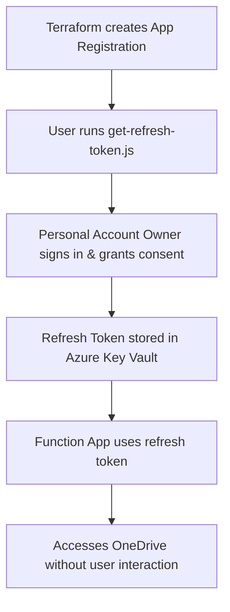

# Setting Up Photo Sync with Personal Microsoft Accounts

This guide explains how to configure PhotoSync when syncing from **personal Microsoft accounts** (outlook.com, hotmail.com, live.com) that aren't part of your Azure Entra organization.

## The Challenge

Personal Microsoft accounts cannot be managed through your organization's Entra portal. You cannot grant "admin consent" for accounts that aren't in your organization.

## Solution: Delegated Permissions with Refresh Tokens

Instead of using **application permissions** (client credentials flow), we use **delegated permissions** (authorization code flow with refresh tokens) where each account owner consents to the app accessing their OneDrive.

## Architecture Overview



## Setup Steps

### Step 1: Configure Terraform Variables

Terraform automatically creates the Azure AD App Registration with the correct permissions. You just need to configure the basic settings:

```bash
cd terraform
cp terraform.tfvars.example terraform.tfvars
```

Edit `terraform.tfvars`:

```hcl
subscription_id               = "your-subscription-id"
resource_group_name           = "photosync-rg"
function_app_name_prefix      = "photosync"
storage_account_name_prefix   = "photosync"
location                      = "westeurope"
enable_keyvault               = true
key_vault_name                = "photosync-kv-UNIQUE"  # Must be globally unique

# OneDrive 1 Configuration (your account)
onedrive1_config = {
  "OneDrive1:SourceFolder"           = "/Pictures/CameraRoll"
  "OneDrive1:RefreshTokenSecretName" = "source1-refresh-token"
  "OneDrive1:ClientSecretName"       = "source1-client-secret"
  "OneDrive1:DeleteAfterSync"        = "false"
  "OneDrive1:MaxFilesPerRun"         = "100"
}

# OneDrive 2 Configuration (second account)
onedrive2_config = {
  "OneDrive2:SourceFolder"           = "/Pictures/CameraRoll"
  "OneDrive2:RefreshTokenSecretName" = "source2-refresh-token"
  "OneDrive2:ClientSecretName"       = "source2-client-secret"
  "OneDrive2:DeleteAfterSync"        = "false"
  "OneDrive2:MaxFilesPerRun"         = "100"
}

# OneDrive Destination Configuration (shared account)
onedrive_destination_config = {
  "OneDriveDestination:RefreshTokenSecretName" = "destination-refresh-token"
  "OneDriveDestination:ClientSecretName"       = "destination-client-secret"
  "OneDriveDestination:DestinationFolder"      = "/Pictures/FamilyPhotos"
}

# Leave these empty for now - we'll fill them in after Step 3
source1_refresh_token      = ""
source2_refresh_token      = ""
destination_refresh_token  = ""
```

### Step 2: Deploy Infrastructure (First Run)

Deploy the infrastructure to create the App Registration:

```bash
# Login to Azure with Microsoft Graph permissions (required for App Registration)
az login --scope https://graph.microsoft.com/.default

# Initialize and apply Terraform
terraform init
terraform apply
```

This creates:
- Azure AD App Registration with correct permissions (Files.Read, Files.ReadWrite, offline_access)
- Client secret (automatically generated and stored in Key Vault)
- Function Apps with managed identities
- Azure Key Vault
- Application Insights for monitoring

### Step 3: Get Refresh Tokens for Each Account

After Terraform completes, get the credentials and run the refresh token script:

```bash
# View the command to generate refresh tokens
terraform output refresh_token_command

# Or run it directly (from the terraform directory)
cd ..
node tools/get-refresh-token.js \
  $(terraform -chdir=terraform output -raw onedrive_app_client_id) \
  $(terraform -chdir=terraform output -raw onedrive_app_client_secret)
```

**What happens:**
1. Browser opens to Microsoft's login page
2. Sign in with the Microsoft account you want to authorize
3. Grant the requested permissions (Files.Read, Files.ReadWrite, offline_access)
4. The script displays the refresh token

**Run for each account** (repeat the command above):
- Your personal account -> save as `source1_refresh_token`
- Second account (e.g., spouse) -> save as `source2_refresh_token`
- Shared destination account -> save as `destination_refresh_token`

### Step 4: Update Terraform with Refresh Tokens

Edit `terraform.tfvars` and add the refresh tokens you obtained:

```hcl
source1_refresh_token      = "M.C553_BAY..."  # Your refresh token
source2_refresh_token      = "M.C558_BAY..."  # Second account refresh token
destination_refresh_token  = "M.C505_BAY..."  # Destination account refresh token
```

Then apply again to store the tokens in Key Vault:

```bash
cd terraform
terraform apply
```

### Step 5: Deploy Function Code

Deployment happens automatically via GitHub Actions when you push to `main`. The workflow:
1. Builds and tests the code
2. Deploys to both Function Apps

To trigger manually, go to **Actions** → **Deploy to Azure** → **Run workflow**.

**For local/manual deployment** (optional):
```bash
SOURCE1=$(terraform output -raw function_app_source1_name)
SOURCE2=$(terraform output -raw function_app_source2_name)
cd ../src
func azure functionapp publish $SOURCE1
func azure functionapp publish $SOURCE2
```

## Done!

Your PhotoSync is now running with personal Microsoft accounts using secure refresh token authentication.

## How It Works

1. **Terraform-Managed App Registration**: The Azure AD app is created automatically with correct permissions
2. **Auto-Generated Client Secret**: Terraform creates and rotates the client secret
3. **Delegated Permissions**: Each user consents individually when running `get-refresh-token.js`
4. **Refresh Tokens**: Long-lived tokens (~90 days) stored in Key Vault, auto-renewed when used
5. **Function Apps**: Use managed identities to retrieve tokens from Key Vault
6. **Token Exchange**: Refresh tokens are exchanged for short-lived access tokens on demand

## Terraform Outputs

After deployment, useful outputs are available:

```bash
# Get the OneDrive app client ID
terraform output onedrive_app_client_id

# Get the client secret (sensitive)
terraform output -raw onedrive_app_client_secret

# Get the command to generate refresh tokens
terraform output refresh_token_command

# Get Function App names for deployment
terraform output function_app_source1_name
terraform output function_app_source2_name
```

## Refreshing Expired Tokens

If refresh tokens expire (after ~90 days of non-use), regenerate them:

```bash
cd /path/to/photosync

# Run the refresh token script
node tools/get-refresh-token.js \
  $(terraform -chdir=terraform output -raw onedrive_app_client_id) \
  $(terraform -chdir=terraform output -raw onedrive_app_client_secret)

# Update terraform.tfvars with the new token
# Then apply to update Key Vault
cd terraform
terraform apply
```

## Azure Login Requirements

- **Normal operations**: `az login` is sufficient
- **Creating/modifying App Registration**: Use `az login --scope https://graph.microsoft.com/.default`

The Graph scope is only needed when Terraform creates or modifies the Azure AD App Registration (first deployment, or after `terraform destroy`).

## Benefits

- **Fully automated**: App Registration created by Terraform
- **One-time setup** per account (just run the refresh token script)
- **No admin consent** required
- **Automatic renewal** - refresh tokens auto-renew when used
- **Secure storage** - all secrets in Azure Key Vault
- **User control** - users can revoke access anytime via their Microsoft account settings
- **Low cost** - only adds ~$0.10/month for Key Vault

## Troubleshooting

### "Insufficient privileges" when running Terraform

Run: `az login --scope https://graph.microsoft.com/.default`

### "Refresh token is invalid or expired"

Regenerate the refresh token using `get-refresh-token.js` and update `terraform.tfvars`.

### "Failed to retrieve refresh token from Key Vault"

- Ensure Function App managed identity has Key Vault access (Terraform handles this automatically)
- Check that refresh tokens are set in `terraform.tfvars` and `terraform apply` was run

### No photos syncing

- Check Function App logs in Application Insights
- Verify source folders contain photos
- Ensure folder paths are correct (relative to OneDrive root)
